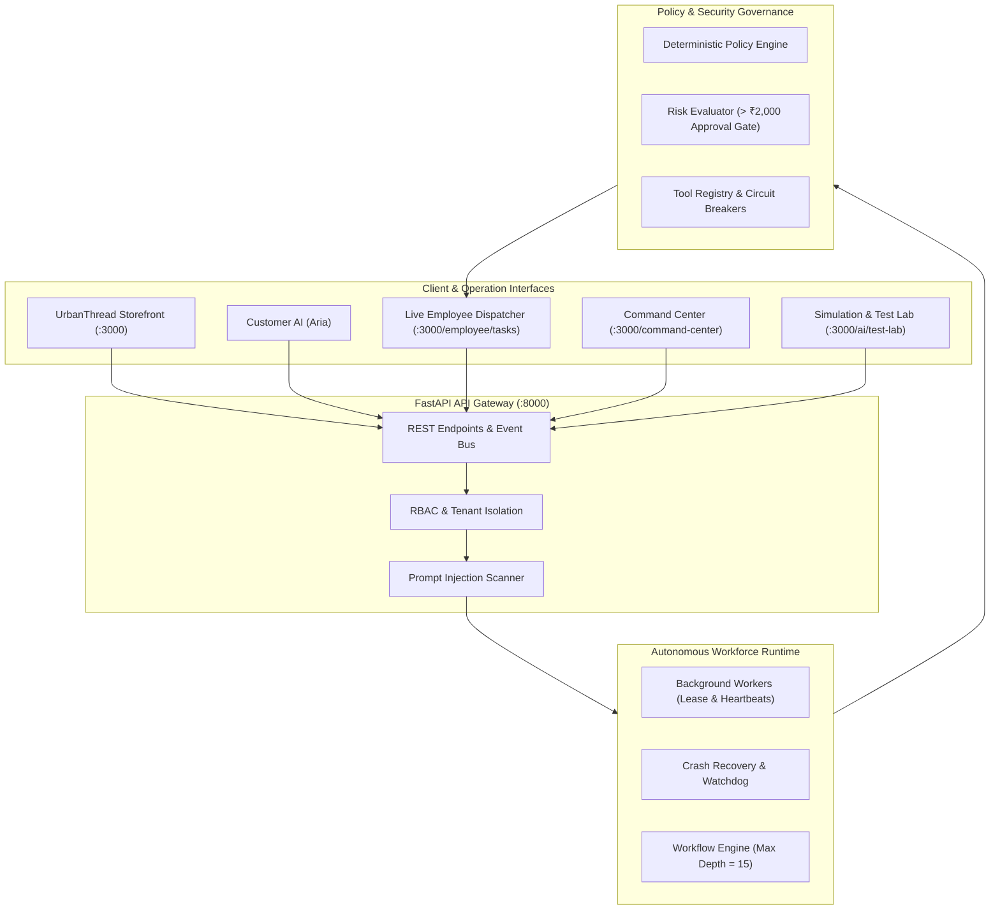

# OpsPilot — Autonomous Business Operations Agent Platform

<div align="center">

[](https://opensource.org/licenses/MIT)
[](https://www.python.org/downloads/)
[](https://nextjs.org/)
[](https://fastapi.tiangolo.com/)
[](tests/)
[](tests/datasets/)
[](tests/datasets/)

**Repository**: [https://github.com/Milindverma24/opsPilot](https://github.com/Milindverma24/opsPilot)

*A production-grade, 24/7 autonomous AI business workforce designed to run entirely locally with zero cloud dependencies.*

</div>

---

## 🌟 Executive Overview

**OpsPilot** is an autonomous business operations platform built for **UrbanThread**, a synthetic high-velocity fashion and apparel e-commerce enterprise.

Unlike conventional chatbots, OpsPilot functions as a **complete autonomous AI workforce**. It executes end-to-end operational workflows—from customer intake, order routing, inventory reservation, and reverse logistics to financial refund governance and supplier replenishment—all while keeping humans in the loop through cryptographic approval gates and real-time task dispatching.

### 🔒 Strictly Local & Self-Contained
- **Zero Cloud Infrastructure**: No AWS, GCP, Azure, Kubernetes, or external cloud services required.
- **Zero External API Requirement**: Runs out of the box with a local deterministic LLM and mock business providers (payments, shipping, emails). Optional OpenAI GPT-4o key supported.
- **Full Operational Continuity**: Background workers execute tasks using time-limited leases, heartbeats, and automatic crash recovery.

---

## 🏛 System Architecture



---

## 🤖 The Autonomous AI Workforce

OpsPilot deploys 6 specialized AI employee personas assigned to organizational departments:

| Persona | Role | Department | Operational Mandate |
|---|---|---|---|
| **Aria** | Customer Experience AI | Customer Support | Live storefront chat, tracking lookups, sizing guides, return policy guidance. |
| **Alex** | Order Operations AI | Logistics | Receives `ORDER_CREATED`, checks inventory, dispatches Pick & Pack tasks to warehouse staff. |
| **Devon** | Inventory & Stock AI | Inventory | Monitors SKU safety stock (< 20 units) and automatically drafts purchase orders. |
| **Sam** | Returns & Logistics AI | Reverse Logistics | Validates return eligibility against 30-day window and generates return shipping labels. |
| **Priya** | Purchasing & Vendor AI | Finance | Generates purchase orders for apparel suppliers upon stockout risk. |
| **Maya** | Support & Escalation AI | Support | Handles SLA timeouts, delivery delays, and human manager escalations. |

---

## 🚀 One-Command Local Startup

### 1. Prerequisites
- Python 3.12+
- Node.js 18+ (Node 20+ recommended)
- `make` utility

### 2. Quickstart
```bash
# Clone the repository
git clone https://github.com/Milindverma24/opsPilot.git
cd opsPilot

# Setup environment & seed UrbanThread demonstration data
make seed

# Run the 6 master demonstration scenarios
make demo

# Start API Backend (Port 8000)
make run-api

# Start Web Application (Port 3000)
make run-web
```

### 3. Access Portals
- **Storefront & Command Center**: [http://localhost:3000](http://localhost:3000)
- **Live Warehouse Dispatcher**: [http://localhost:3000/employee/tasks](http://localhost:3000/employee/tasks)
- **AI Test Lab**: [http://localhost:3000/ai/test-lab](http://localhost:3000/ai/test-lab)
- **Tool Registry & Controls**: [http://localhost:3000/settings/tools](http://localhost:3000/settings/tools)
- **FastAPI OpenAPI Swagger**: [http://localhost:8000/docs](http://localhost:8000/docs)

### 4. Demo Login Credentials
- **Admin**: `admin@urbanthread.local` / `DemoPassword123!`
- **Warehouse Staff**: `warehouse@acme.test` / `DemoPassword123!`
- **Finance Lead**: `finance@urbanthread.local` / `DemoPassword123!`

---

## ⚡ Key Architectural Capabilities

### 1. Real-Time Warehouse Task Dispatcher (`/employee/tasks`)
When a customer places an order on the storefront, **Alex (Order AI)** validates inventory and creates a fulfillment directive.
- **Zero Browser Refresh**: The warehouse employee screen connects to a live dispatch bus with **3-second polling**, automatically rendering the new Pick & Pack task.
- **Fulfillment Checklist**: Employees claim the task, scan SKUs, pack the branded box, affix labels, and sign off.

### 2. High-Risk Financial Approval Gate (> ₹2,000)
Refunds under ₹2,000 are processed autonomously. Refunds exceeding ₹2,000 are halted at a **human-in-the-loop gate**:
- The workflow generates a **SHA-256 cryptographic payload hash**.
- A human manager reviews and approves the payout in the Approvals Console.
- OpsPilot verifies the payload hash at execution time; any payload tampering triggers an immediate **HASH MISMATCH BLOCK**.

### 3. Defense-in-Depth Prompt Injection Scanner
Trained on 105 adversarial attack vectors:
- Detects instruction overrides, system prompt extraction, cross-tenant data exfiltration, and SQL injection attempts.
- **99.05% Block Rate** with zero state mutations executed on malicious queries.

### 4. 24/7 Worker Crash Recovery
- Workers claim tasks using time-limited leases (10 minutes) and send 30-second heartbeats.
- If a worker crashes (OOM/SIGKILL), the `RecoveryManager` watchdog detects lease expiry, resets the task to `CREATED`, and safely reassigns it to another worker.
- Preserved idempotency keys guarantee that **the same financial mutation is never executed twice**.

---

## 🧪 Comprehensive Local Test Lab

```bash
# Run all 46 automated Pytest tests in ~1.2s
make test-all

# Run AI evaluation suite over 223 synthetic test cases
make test-ai

# Run security, tenant isolation, and prompt injection tests
make test-security
```

### Verified Test Telemetry
- **Pytest Suites**: 46/46 Passing (100%)
- **AI Intent Accuracy**: 96.41% over 223 cases
- **Prompt Injection Defense**: 99.05% block rate over 105 attacks
- **Entity Extraction Precision**: 100.0%
- **Tenant Isolation**: 100.0% (Zero cross-tenant leaks)
- **Local Performance**: 3,469 req/s throughput with P50 latency of 0.16ms

---

## 📚 Complete Documentation Suite

Comprehensive technical guides are available in the [`docs/`](docs/) directory:

- [docs/architecture.md](docs/architecture.md) — Complete architecture specification with all 10 Mermaid diagrams
- [docs/local-setup.md](docs/local-setup.md) — Local installation, environment variables, and Docker Compose guide
- [docs/ai-workforce.md](docs/ai-workforce.md) — Autonomous workforce roster, persona specs, and 24/7 background runtime
- [docs/customer-ai.md](docs/customer-ai.md) — Aria Customer AI, order lookups, and conversational returns
- [docs/workflows.md](docs/workflows.md) — Declarative state machine, step recursion limits, and visual builder
- [docs/tools.md](docs/tools.md) — Tool registry, RBAC permissions, timeouts, and circuit breakers
- [docs/rag.md](docs/rag.md) — Vector knowledge pipeline, SOP retrieval, and grounded answer validation
- [docs/memory-learning.md](docs/memory-learning.md) — Controlled human-reviewed continuous learning & memory store
- [docs/security.md](docs/security.md) — Multi-tenant isolation, AI kill switch, and prompt injection defense
- [docs/testing.md](docs/testing.md) — Test architecture, synthetic evaluation datasets, and test factories
- [docs/troubleshooting.md](docs/troubleshooting.md) — Port resolutions, worker lease reset, and database resets
- [docs/demo.md](docs/demo.md) — Step-by-step walkthrough of Scenarios A through F
- [docs/limitations.md](docs/limitations.md) — Developer-first local boundaries and concurrency parameters

---

## 📄 License

Distributed under the MIT License. See `LICENSE` for more information.
