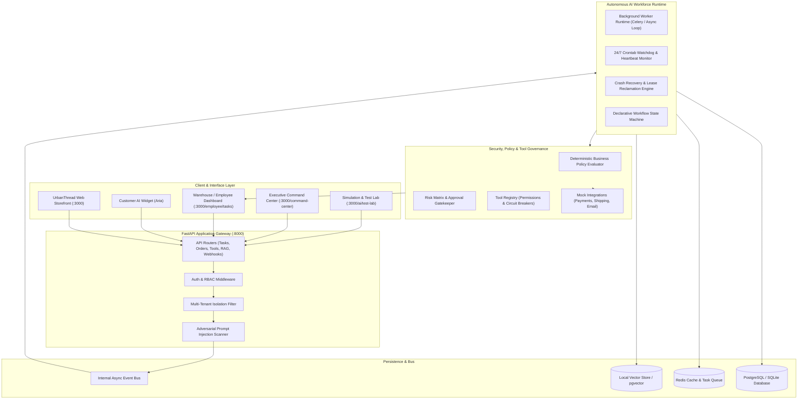
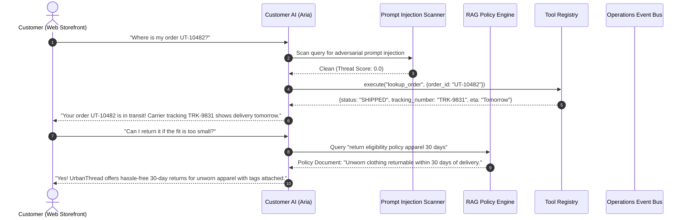
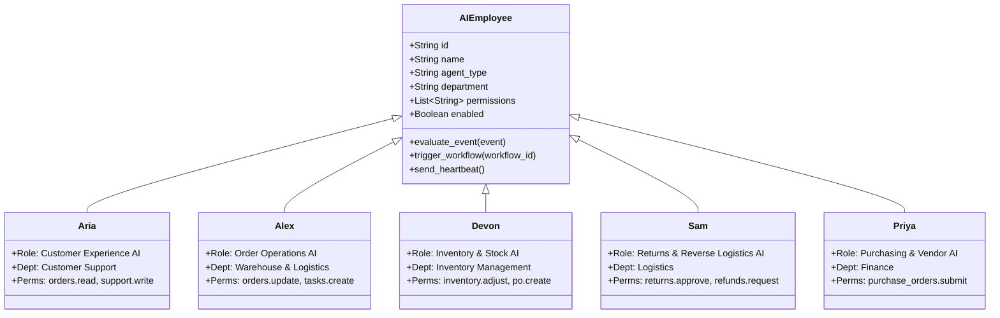
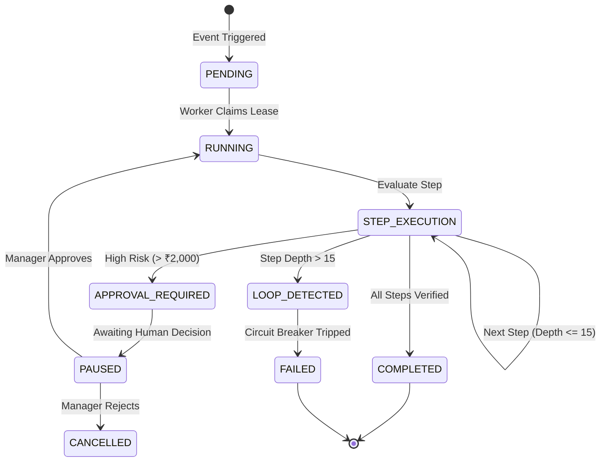
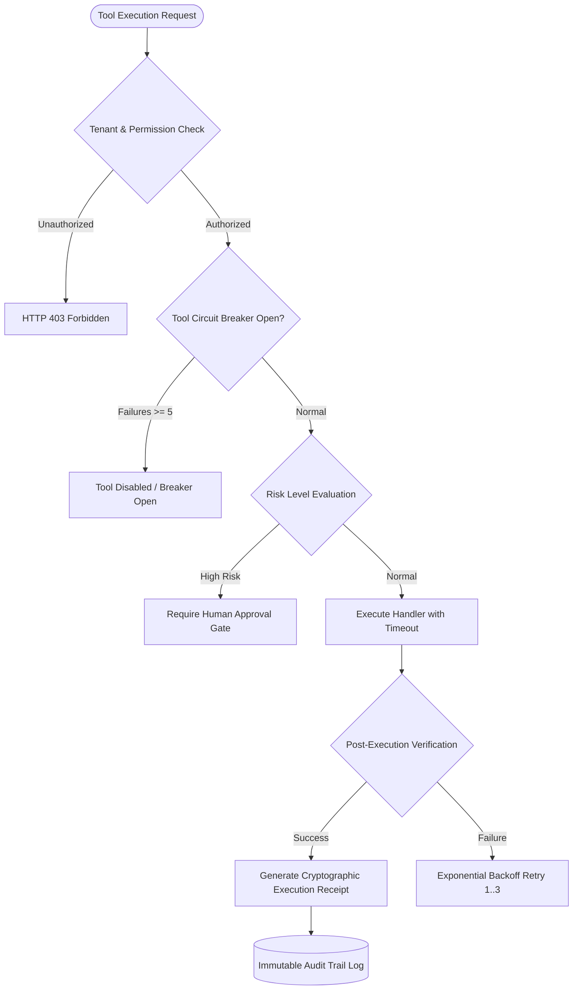
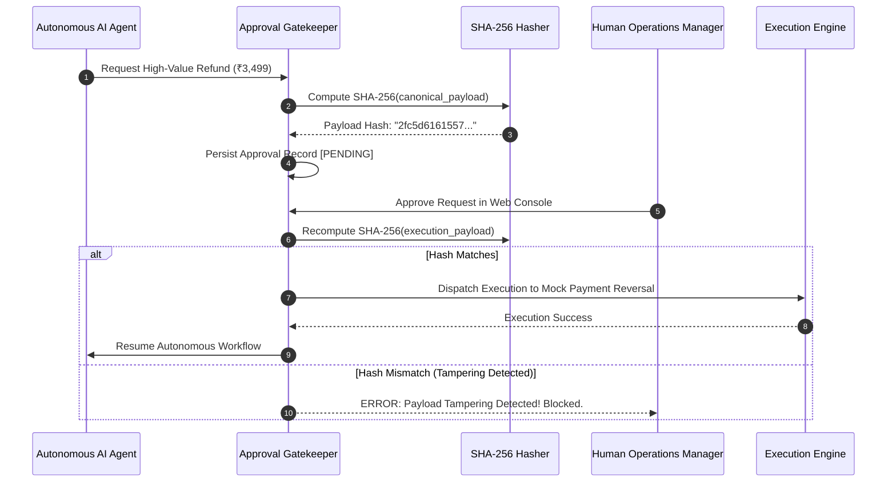
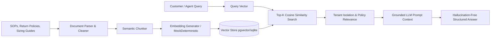
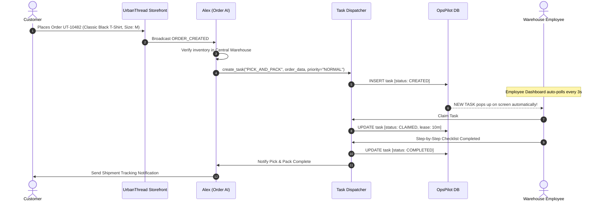
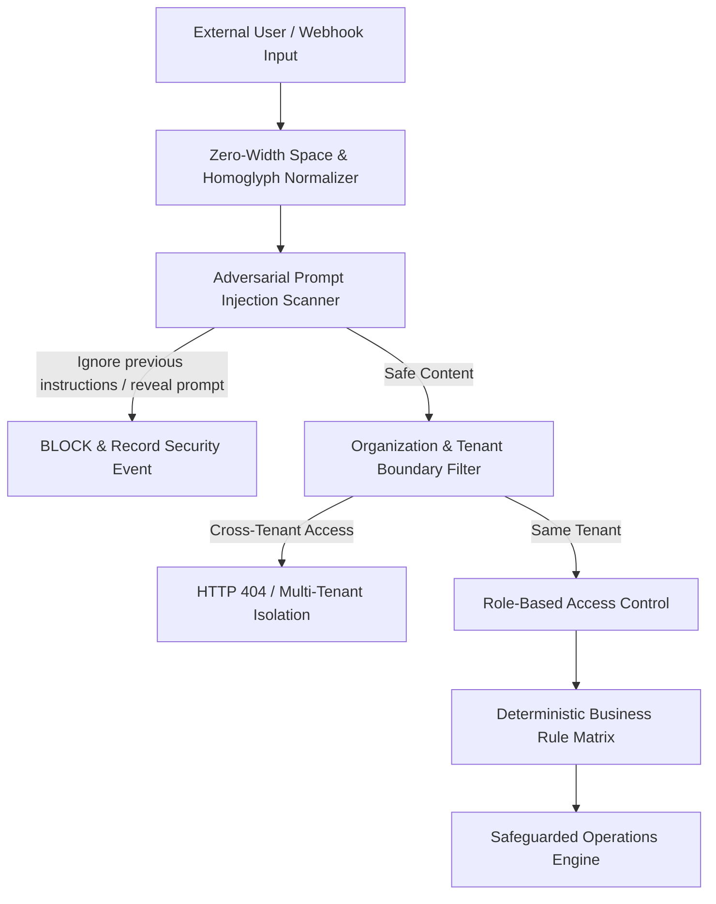
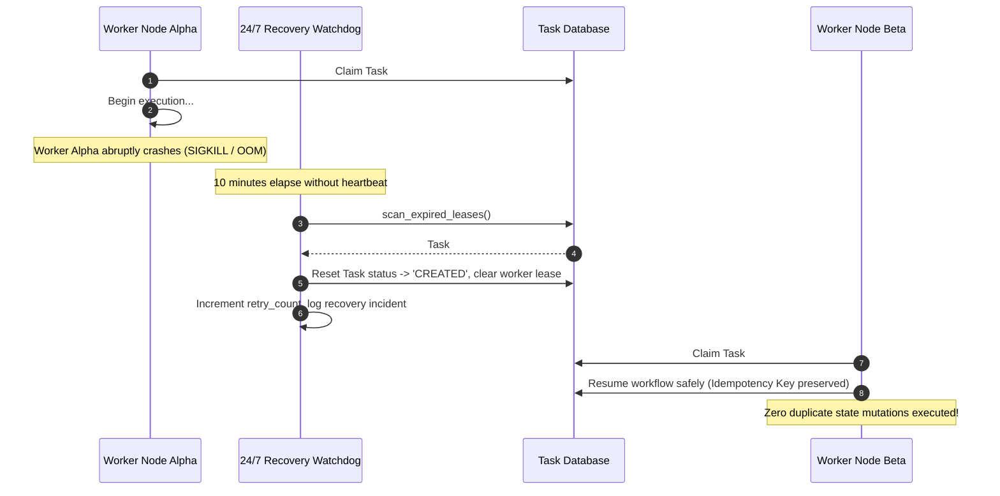

# OpsPilot Architecture Specification

This document details the architectural design of **OpsPilot**, a 24/7 autonomous business operations agent platform running locally for **UrbanThread** (synthetic fashion & apparel e-commerce).

---

## 1. Overall System Architecture

---

## 2. Customer AI Architecture (Aria)

---

## 3. AI Employee Architecture

Each AI employee is an autonomous agent persona with defined operational permissions, bound to an organizational department:

---

## 4. Workflow Engine Architecture

The workflow engine executes acyclic directed execution graphs with loop protection (`MAX_STEP_DEPTH = 15`) and persistent state transitions:

---

## 5. Tool Execution Architecture

---

## 6. Approval Flow & Payload Integrity

To prevent tampering between approval request creation and human execution:

---

## 7. RAG Knowledge Pipeline Architecture

---

## 8. Real-Time Employee Task Dispatching

---

## 9. Security Architecture

OpsPilot implements strict Defense-in-Depth for local AI operations:

---

## 10. 24/7 Workforce Runtime & Worker Crash Recovery

