# OpsPilot Database & Data Foundation Specification

## 1. Overview
The OpsPilot data foundation provides an enterprise-grade multi-tenant relational and vector data architecture built on SQLAlchemy 2.0 and Alembic. It models all facets of autonomous operations—from enterprise governance, web crawlers, and business documents to multi-agent state machines, human approvals, and append-only audit trails.

### Core Architectural Principle: AI Agent Database Isolation
The AI agent fleet **NEVER directly accesses the database** and cannot execute arbitrary SQL queries. All data access occurs strictly through controlled layers:
```
Company Data (PostgreSQL / SQLite)
       ▲
       │
Backend Services Layer (OrganizationService, InvoiceService, etc.)
       ▲
       │
Permission & Tenant Authorization Checks (RBAC + organization_id)
       ▲
       │
Controlled Agent Tools (ToolRegistry)
       ▲
       │
OpsPilot AI Multi-Agent Fleet
```

---

## 2. Entity-Relationship (ER) Diagram

```mermaid
erDiagram
    ORGANIZATION ||--o{ DEPARTMENT : contains
    ORGANIZATION ||--o{ USER : employs
    ORGANIZATION ||--o{ VENDOR : transacts_with
    ORGANIZATION ||--o{ CUSTOMER : serves
    ORGANIZATION ||--o{ WEBSITE : indexes
    ORGANIZATION ||--o{ DOCUMENT : owns
    ORGANIZATION ||--o{ INVOICE : records
    ORGANIZATION ||--o{ PURCHASE_ORDER : issues
    ORGANIZATION ||--o{ COMPLAINT : receives
    ORGANIZATION ||--o{ WORKFLOW : executes
    ORGANIZATION ||--o{ POLICY : enforces
    ORGANIZATION ||--o{ KNOWLEDGE_DOCUMENT : grounds
    ORGANIZATION ||--o{ AUDIT_LOG : tracks

    DEPARTMENT ||--o{ TEAM : groups
    DEPARTMENT ||--o{ USER : assigns
    
    ROLE ||--o{ USER : grants
    ROLE ||--o{ ROLE_PERMISSIONS : maps
    PERMISSION ||--o{ ROLE_PERMISSIONS : defines

    WEBSITE ||--o{ WEBSITE_PAGE : crawls
    
    DOCUMENT ||--o{ DOCUMENT_CHUNK : chunks
    DOCUMENT ||--o{ INVOICE : extracts_to
    DOCUMENT ||--o{ COMPLAINT : extracts_to
    
    VENDOR ||--o{ PURCHASE_ORDER : receives
    VENDOR ||--o{ INVOICE : bills
    PURCHASE_ORDER ||--o{ PURCHASE_ORDER_ITEM : includes
    PURCHASE_ORDER ||--o{ INVOICE : matches
    
    INVOICE ||--o{ INVOICE_LINE_ITEM : details
    CUSTOMER ||--o{ COMPLAINT : files

    WORKFLOW ||--o{ WORKFLOW_STEP : sequences
    WORKFLOW ||--o{ APPROVAL : pauses_for
    WORKFLOW ||--o{ AGENT_RUN : records
    AGENT ||--o{ AGENT_RUN : executes
    AGENT_RUN ||--o{ AGENT_MESSAGE : logs
    AGENT_RUN ||--o{ TOOL_EXECUTION : invokes
    TOOL ||--o{ TOOL_EXECUTION : defines

    POLICY ||--o{ POLICY_RULE : contains
    KNOWLEDGE_DOCUMENT ||--o{ KNOWLEDGE_CHUNK : embeds
```



---

## 3. Detailed Table Specifications

### 3.1 Organization & Identity Domain
| Table Name | Primary Key | Key Foreign Keys | Purpose |
| :--- | :--- | :--- | :--- |
| `organizations` | `id` (UUID) | None | Enterprise tenant boundary with industry, timezone, currency, and autonomous policy thresholds. |
| `departments` | `id` (UUID) | `organization_id` | Divisions (Finance, Operations, Support, Procurement, Legal, etc.). |
| `teams` | `id` (UUID) | `organization_id`, `department_id` | Operational squads (Accounts Payable, Tier 2 Care). |
| `roles` | `id` (UUID) | `organization_id` (null for system) | RBAC roles (`SUPER_ADMIN`, `FINANCE_MANAGER`, `AUDITOR`). |
| `permissions` | `id` (UUID) | None | Granular authorizations (`invoices.approve`, `tools.execute`). |
| `role_permissions` | Composite | `role_id`, `permission_id` | Association table. |
| `users` | `id` (UUID) | `organization_id`, `department_id`, `role_id` | User identity with bcrypt password hashing, status (`ACTIVE`, `SUSPENDED`), `email_verified`, `failed_login_attempts`, and lockout tracking. |
| `user_sessions` | `id` (UUID) | `user_id`, `organization_id` | Server-managed session registry storing SHA-256 hashed refresh tokens, client IP, user agent, expiration, and revocation timestamps. |
| `password_reset_tokens` | `id` (UUID) | `user_id`, `organization_id` | Single-use expiring password recovery tokens stored as SHA-256 hashes. |
| `user_teams` | Composite | `user_id`, `team_id` | Team membership association table. |

### 3.2 Web & Ingestion Domain
| Table Name | Primary Key | Key Foreign Keys | Purpose |
| :--- | :--- | :--- | :--- |
| `websites` | `id` (UUID) | `organization_id` | Company websites registered for automated crawl tracking. |
| `website_pages` | `id` (UUID) | `website_id`, `organization_id` | Untrusted crawled page contents, SHA-256 content hashes, and HTTP status codes. Deduplicated on `(website_id, url)`. |
| `business_events` | `id` (UUID) | `organization_id` | Inbound intake queue for documents, emails, webhooks, and manual uploads. Unique on `(organization_id, idempotency_key)`. |
| `documents` | `id` (UUID) | `organization_id`, `event_id` | Uploaded PDFs, invoices, and contracts. Tracks SHA-256 checksum, quarantine status, and extracted fields. |
| `document_chunks` | `id` (UUID) | `document_id`, `organization_id` | Segmented document passages with vector embeddings and token counts. |
| `emails` | `id` (UUID) | `organization_id` | Inbound email metadata, sender, recipients, and attachments. |

### 3.3 Operations & Financial Domain
| Table Name | Primary Key | Key Foreign Keys | Constraints & Indexes |
| :--- | :--- | :--- | :--- |
| `vendors` | `id` (UUID) | `organization_id` | Index on `(organization_id, vendor_code)`. Stores GSTIN, address, risk level, and bank details. |
| `customers` | `id` (UUID) | `organization_id` | Index on `(organization_id, customer_number)`. |
| `purchase_orders`| `id` (UUID) | `organization_id`, `vendor_id` | Check: `total >= 0`, `subtotal >= 0`, `tax >= 0`. Unique index on `(organization_id, po_number)`. |
| `purchase_order_items` | `id` (UUID) | `purchase_order_id` | Itemized goods, quantities, rates, taxes. |
| `invoices` | `id` (UUID) | `organization_id`, `vendor_id`, `purchase_order_id`, `document_id` | Check: `total >= 0`, `subtotal >= 0`, `tax >= 0`, `risk_score >= 0 AND <= 100`, `ai_confidence >= 0 AND <= 1`. Unique index on `(organization_id, invoice_number)`. |
| `invoice_line_items` | `id` (UUID) | `invoice_id` | Itemized billing lines and tax breakdowns. |
| `complaints` | `id` (UUID) | `organization_id`, `customer_id`, `document_id`, `source_email_id` | Tracks sentiment, urgency, priority (P1-P4), refund requests, and AI confidence. |
| `tasks` | `id` (UUID) | `organization_id`, `created_by`, `assigned_to`, `workflow_id` | Human operations queue for escalated workflow actions. |

### 3.4 Multi-Agent State Machine & Execution
| Table Name | Primary Key | Key Foreign Keys | Purpose |
| :--- | :--- | :--- | :--- |
| `workflows` | `id` (UUID) | `organization_id`, `business_event_id`, `document_id` | Finite state machine tracking autonomous pipeline execution. Unique on `idempotency_key`. |
| `workflow_steps` | `id` (UUID) | `workflow_id` | Ordered step telemetry (INTAKE -> CLASSIFY -> EXTRACT -> VALIDATE -> POLICY -> RISK -> PLAN -> EXECUTE). |
| `approvals` | `id` (UUID) | `organization_id`, `workflow_id`, `approved_by` | Human-in-the-loop sign-off gate for high-value or high-risk actions. |
| `agents` | `id` (UUID) | `organization_id` (optional) | Registered agent definitions, prompts, and model configurations. |
| `agent_runs` | `id` (UUID) | `organization_id`, `agent_id`, `workflow_id` | Token telemetry, execution latency, cost estimation, and output data. |
| `agent_messages` | `id` (UUID) | `agent_run_id` | Structured dialogue traces including evidence, policies evaluated, and decisions. |
| `tools` | `id` (UUID) | `organization_id` (optional) | Tool registry definitions, input schemas, risk tiers, and required permissions. |
| `tool_executions`| `id` (UUID) | `organization_id`, `tool_id`, `workflow_id`, `agent_run_id` | Execution timestamps, duration, mock vs live status, and return payloads. |

### 3.5 Governance, Knowledge & Audit
| Table Name | Primary Key | Key Foreign Keys | Constraints |
| :--- | :--- | :--- | :--- |
| `policies` | `id` (UUID) | `organization_id`, `created_by` | Business governance rules (e.g., FIN-001, SUP-001). |
| `policy_rules` | `id` (UUID) | `policy_id`, `organization_id` | Automated condition predicates (`invoice.total > 100000`) and enforcement actions (`REQUIRE_APPROVAL`). |
| `knowledge_documents` | `id` (UUID) | `organization_id`, `document_id` | Grounded company SOPs, manuals, and compliance guidelines. |
| `knowledge_chunks` | `id` (UUID) | `knowledge_document_id`, `organization_id` | Embeddings and semantic search chunks. |
| `audit_logs` | `id` (UUID) | `organization_id` | **Append-only immutable audit trail**. No update or delete operations exposed. |
| `notifications` | `id` (UUID) | `organization_id`, `user_id` | In-app alerts for pending approvals and system status broadcasts. |
| `integrations` | `id` (UUID) | `organization_id` | Encrypted external service credentials (ERP, payment gateways, ticketing). |

---

## 4. Multi-Tenancy Architecture
1. **Partitioning Model**: Logical multi-tenancy with row-level `organization_id` column on all tenant-specific tables.
2. **Context Resolution**: The `organization_id` is never trusted from client query parameters or request bodies; it is derived strictly from the verified JWT access token of the authenticated user.
3. **Database Indexing**: Composite indexes `(organization_id, created_at)`, `(organization_id, status)`, `(organization_id, invoice_number)`, `(organization_id, idempotency_key)` guarantee zero cross-tenant query contamination and high-performance filtering.
4. **Verification**: Automated regression tests (`test_tenant_isolation_api`) verify that attempting to read another company's records returns HTTP 404/403 with zero data leakage.

---

## 5. Dual Vector Storage Strategy
- **Production (PostgreSQL + pgvector)**:
  - Supports `pgvector.sqlalchemy.Vector(384)` with IVFFlat or HNSW indexing.
  - Enabled via migration hook `CREATE EXTENSION IF NOT EXISTS vector;`.
- **Local Dev / Testing (SQLite)**:
  - Vector embeddings are serialized as JSON float arrays (`Column(JSON)`).
  - Cosine similarity is computed in-memory via optimized NumPy vector dot products.
  - Seamless zero-configuration testing without external database dependencies.

---

## 6. Alembic Migrations & Idempotent Seeding

### Migration Execution
```bash
# Apply all pending schema migrations
make migrate
# Or directly via Alembic:
.venv/bin/alembic upgrade head
```

### Idempotent Seed Execution
```bash
# Seed realistic synthetic demo company data
make seed
# Or directly via Python:
.venv/bin/python scripts/seed.py
```
**Idempotency Guarantee**: The seed script checks for natural unique keys (e.g. `slug`, `email`, `tax_id`, `po_number`, `invoice_number`, `code`) before creating entities. Running `make seed` repeatedly produces zero duplicate records.
