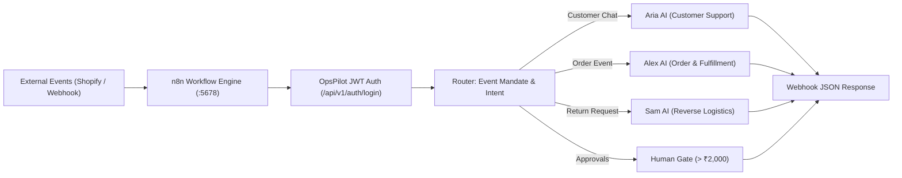

# OpsPilot — n8n Autonomous Operations Workflow Integration

This integration provides a ready-to-import **n8n workflow** that connects external business channels (e-commerce storefronts, Shopify, webhooks, WhatsApp, customer support forms) directly to the **OpsPilot Local Autonomous Business Operations Platform**.

---

## ⚡ Architecture Overview



---

## 🚀 How to Run n8n Locally

### Option 1: Using Docker (One Command)
```bash
docker run -it --rm \
  --name n8n \
  -p 5678:5678 \
  -e WEBHOOK_URL=http://localhost:5678/ \
  -v ~/.n8n:/home/node/.n8n \
  n8nio/n8n
```
> **Note on Docker networking on macOS**: If n8n runs inside Docker and OpsPilot runs on your host machine, set the API URL in the n8n constants node to `http://host.docker.internal:8000/api/v1`.

### Option 2: Using npx (Zero Docker)
```bash
npx n8n
```
Open **[http://localhost:5678](http://localhost:5678)** in your browser.

---

## 📥 How to Import the Workflow

1. Open your local n8n dashboard at `http://localhost:5678`.
2. In the top-right menu, click the **three dots (`...`)** -> **Import from File**.
3. Select `integrations/n8n/opspilot-operations-flow.json` (or copy the contents and select **Import from Clipboard**).
4. Click **Save** and toggle the workflow to **Active**.

---

## 🧪 Testing the n8n Flow

Once the workflow is active in n8n, test it with sample webhooks using `curl`:

### 1. Customer Support AI Query (Aria AI)
```bash
curl -X POST http://localhost:5678/webhook/opspilot-events \
  -H "Content-Type: application/json" \
  -d '{
    "action_type": "CUSTOMER_CHAT",
    "customer_id": "cust-demo-01",
    "order_number": "UT-68293",
    "message": "Where is my order UT-68293 and when will it arrive?"
  }'
```

### 2. New Order Placement (Alex AI & Warehouse Dispatch)
```bash
curl -X POST http://localhost:5678/webhook/opspilot-events \
  -H "Content-Type: application/json" \
  -d '{
    "action_type": "ORDER_CREATED",
    "title": "New Order Placed: UT-77102",
    "content": "Customer placed order for 2x Classic Denim Jacket.",
    "event_type": "ORDER_CREATED",
    "metadata": {
      "order_number": "UT-77102",
      "sku": "UT-JAC-DEN-01",
      "quantity": 2,
      "amount": 6998.0
    }
  }'
```

### 3. High-Value Return Request (> ₹2,000 Approval Gate)
```bash
curl -X POST http://localhost:5678/webhook/opspilot-events \
  -H "Content-Type: application/json" \
  -d '{
    "action_type": "RETURN_REQUEST",
    "order_number": "UT-68293",
    "amount": 3499.0,
    "reason": "Garment size does not fit. Requesting refund to original payment method."
  }'
```
*Because the amount is ₹3,499.0 (> ₹2,000 threshold), the n8n flow routes through the Human-in-the-Loop manager gate and links to the [OpsPilot Approvals Portal](http://localhost:3000/approvals).*

---

## 🔐 Credentials & Default Tokens

The flow automatically authenticates against OpsPilot using:
- **API URL**: `http://localhost:8000/api/v1` (or `http://host.docker.internal:8000/api/v1` if using Docker n8n)
- **Service Account**: `admin@urbanthread.local`
- **Password**: `DemoPassword123!`
- **Access Token Life**: Handled dynamically per webhook execution.
